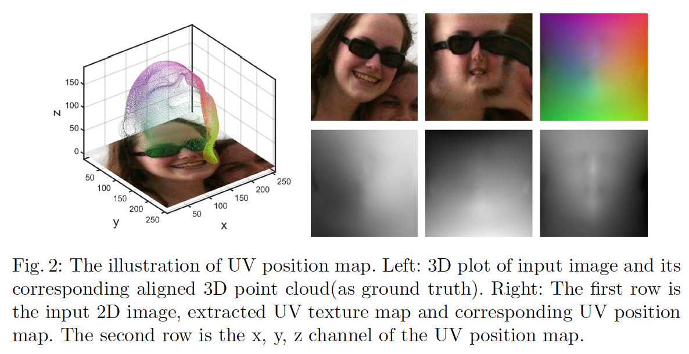

# Joint 3D Face Reconstruction and Dense Alignment with Position Map Regression Network

author: Yao Feng / ECCV 2018

# Abstract

이 논문의 키워드는 2가지입니다. 

**3D Face Reconstruction**    2D 이미지 얼굴의 특징점을 찾아 3D 얼굴 구조를 복원.

**Dense Face Alignment**

이를 위해 UV Position map 을 이용해 2D 이미지를 표시하고, 간단한 Convolutional Neural Network를 학습합니다. 또한 네트워크 성능을 높이기 위해 weight mask를 loss function과 통합하였습니다. 이 논문의 방법은 다른 이전 face model에 의존하지 않으며 semantice meaning 을 통해 완전한 얼굴 형태를 복원할 수 있습니다.

또한 이 네트워크는 매우 가볍고 한 이미지를 처리하는 데 오직 9.8ms의 시간이 들기 때문에 이전 네트워크들보다 매우 빠릅니다. 다양한 데이터셋에서의 실험결과는 해당 논문의 방법이 reconsturction과 alignment에 있어서 다른 SOTA 방법을 크게 뛰어넘었다고 보여주고 있습니다.

# 1. Introduction

3D face reconstruction과 face alignment는 컴퓨터 비전에서 매우 기본적이며 서로 관련깊은 주제입니다. face alignment는 2D 기준점들을 찾는 것으로 다른 얼굴 인식과 같은 facial task들을 하기 위한 선행 작업으로 많이 사용되며 3D face reconstruction을 보조하는 방법입니다.

### 어려움

하지만 face alignment는 다양한 포즈 종류와 occlusion(숨김 현상)의 어려움이 있습니다. 따라서 이전 작업에서는 3D Morphable Model(3DMM)을 효과적으로 측정하기 위해 CNN을 사용하였고, 하나의 2D 얼굴 이미지로 부터 3D 정보를 생성하기 위해 3D model warping function을 사용하여 dense face alignment와 3D face reconstruction 결과를 얻었습니다. 하지만 이러한 방법은 face model로 부터 생성된 3D space의 한계로 인해 제한 적입니다. 또한 투시 투영(perspective projection) 이나 3D Thin Plate Spline(TPS) 변형과 같은 연산이 필요하여 전체 프로세스의 복잡도를 높였습니다.

### 관련 논문

// TODO

이 논문에서는 end-to-end 방법인 Position map Regression Network(PRNet)을 제안하여 dense alignment 예측과 3D face shape reconstruction을 동시에 진행합니다. 
전체 얼굴의 기준 점들의 3D 좌표를 표시한 2D 이미지로 각 UV place에 semantic meaning을 내포하는 UV position map을 디자인 하였습니다. 또한 간단한 encoder-decoder 네트워크를 2D 얼굴 이미지로부터 UV position map으로 regress 하는데 식별되는 부위에 가중치를 둔 weighted loss와 함께 학습하였습니다. 따라서 포즈, 조명, 숨김 현상에 매우 강합니다.

### Contribution 요약

    1. end-to-end 네트워크 중 처음으로 저차원 공간에서의 제한없이 face alignment와 3D face reconstruction을 함께 해결하였습니다.
    2. 3D 얼굴 구조를 직접적으로 예측하고 dense alignment를 위해 UV position map이라는 새로운 표현방법을 개발하였습니다. UV position map은 좌표 정보를 UV space 상에 기록한것으로 각 점이 semantic meaning와 밀접하게 대응하여 3D 얼굴의 좌표를 제공합니다.
    3. position map상의 각점마다 다른 값의 weight mask를 주어 학습 성능을 올렸습니다.
    4. 100FPS 이상으로 빠르게 작동되는 light-weighted 프레임워크를 제공하여 2D 이미지로 부터 3D 얼굴 복원과 alignment 결과를 바로 얻을 수 있게 되었습니다.
    5. 이 논문의 방법이 다른 SOTA에 비해 AFLW2000-3D 와 Florence 데이터셋에서의 결과가 3D 얼굴복원, dense face alignment 모두 25% 이상 성능향상 되었습니다.

# 2. Related Works

// TODO

# 3. Proposed Method

### 3.1. 3D Face Representation

**한 장의 2D 이미지로 부터 3D 얼굴 형태와 이에 대응하는 정보(dense correspondence info)를 예측하는 것**이 목표입니다.

가장 간단하고 주로 쓰이는 방법은 3D 얼굴의 모든 좌표를 벡터처럼 연결하고 네트워크가 이를 예측하도록 하는 것입니다. 그러나 3D space를 1차원 벡터로 프로젝션하게 되면 점들 간의 공간 상 인접 정보를 잃게 되고  deep neural network를 학습하기 어렵습니다. 왜냐하면 공간 상 인접된 점들은 그들의 좌표를 예측할 때 인접된 weight를 공유하여 컨볼루션 레이어를 통해 쉽게 얻어지는 반면, 1차원 벡터로 된 좌표는 각 점들을 찾기 위해 FC layer 연산이 필요하여 더 많은 파라미터가 필요하고 네트워크의 사이즈가 커지기 때문입니다.
논문 [16]에서는 point set generation network로 2D이미지로부터 3D object의 포인트 좌표를 벡터로 직접 생성하는 방법을 제한하지만, 포인트 개수의 최대값은 오직 1024개로 정확한 3D face를 생성 하기에는 부족합니다.

이전 논문들의 문제를 해결하기 위해 이 논문에서는 UV position map(이하 position map)을 통해 3D facial structure를 alignment information과 함께 표현합니다. Position map은 UV space 안에 3D좌표를  2D 이미지에 표현한 것 입니다. 지금까지 UV space는 texture map이나 height map, 3D geometry image, rmflrh 3D facial mesh 간의 일치성을 표현하기 위해 사용 되었습니다.
이전과 다르게 이 논문은 2D facial image에 대응하는 3D face model의 좌표들을 저장하기 위해 UV space를 사용합니다. 
~~Figure 2에 보이는 것 처럼 3D 모델을 2D 이미지로 단순히 프로젝션하는 것은 weak perspective projection으로 3D facial position을 Left-heanded Cartesian Coordinate system에 정의하였습니다.~~ 

3D facial shape Ground Truth를 x-y 평면에 투영하면 2D 이미지와 비교하면 정확하게 맞아 떨어집니다. 
따라서  다음과 같이 표현할 수 있습니다.

$$Pos(u_i, v_i) = (x_i,y_i,z_i)$$

(u_i, v_i): UV 좌표의 i번쨰 점의 좌표
(x_i, y_i,z_i): 대응하는 3D 좌표, z_i: 이 점의 depth
x,y,z를 RGB value의 r,g,b에 대응하여 쉽게 표기하였음.

따라서 position map은 3D face의 밀도 높은 좌표 집합을 semantic meaning과 함께 표기할 수 있도록 하여, CNN을 이용하여 2D 이미지로부터 3D 얼굴 구조와 dense alignment result를 동시에 직접적으로 예측할 수 있도록 합니다. 이러한 편리함으로 네트워크 구조는 매우 간단해졌습니다.
또한 얼굴의 보이지 않은 부분을 추론할 수 있어 3D face를 완전하게 예측합니다.

2D 이미지로 부터 직접적으로 완전한 3D structure를 얻는 ene-to-end training을 위해서 굉장히 많은 2D 이미지와 그에 대응하는 3D shape가 필요합니다. 300W-LP는 60K이상의 매우 큰 데이터셋으로 Basel Face Method(BFM)기반의 3DMM parameter로 맞춰져있습니다. 따라서 이 데이터셋을 활용하기 위해서 BFM에 해당하는 UV 좌표를 생성하였습니다. BFM의 꼭지점의 개수는 50K 이상이기 때문에 position map 사이즈에 맞추어 256개를 선택하였고 무시가능한 resample error를 내는 high precision point cloud를 구하였습니다.

### 3.2. Network Architecture and Loss Function

네트워크는 입력 RGB 이미지를 position map 이미지로 바꾸기 때문에 transfer function을 학습하기 위해 encoder-decoder 구조를 사용하였습니다.

### 

- **Encoder Part**
1 conv layer (256x256x3 input image) + 10 res blocks (8x8x512 feature map)
**Decoder Part**
17 transposed convolution layers (256x256x3 position map output)
- kernel size: 4
- activation function: ReLU
- **Loss function**
Ground Truth position map 과 네트워크 output 의 차이

    $$Loss = \sum||Pos(u,v) - Pos'(u,v)||* W(u,v)$$

    Pos'(u,v): ground truth position map
    W(u,v): weight mask

        주로 Mean square error(MSE)가 이러한 학습에 사용 되지만 이 방법은 모든 점들에 같은 가중치를 두기 때문에 position map 학습에 효율적이지 않아 사용하지 않았습니다. 왜냐하면 얼굴 중심부는 다른 부분보다 더 많은 차별적인 특징을 가지기 때문입니다. 따라서 weigth mask를 사용하였습니다.
        Figure 4에 보이는 것처럼 weight mask는 position map 상에 픽셀마다 대응되도록 회색 이미지로 표현하였습니다. 각 점들을 4개의 카테고리로 나누었고 이는 loss function에서 특정 weight 를 가집니다. 
        - 68개의 얼굴 키포인트는 가장 높은 weight 를 가지며 네트워크가 이 점들의 정확한 위치를 학습할 수 있도록 해줍니다.
        - 목 부분은 중요도가 적고 머리카락이나 옷으로 인해 가려지는 경우가 종종 발생합니다. 따라서 목이나 옷의 3D shape를 학습하는 것은 관심 밖의 것이므로 weight를 0으로 지정하여 학습 과정의 방해 요소를 줄였습니다.
        즉, 다음과 같은 비율을 사용하였습니다.
        subregion1(68 facial landmarks):subregion2(eye,nose,mouth):subregion3(other face area):subregion4(neck) = 16:4:3:0

    

### 3.3. Training Details

// TODO

# 4. Experimental Results

### 4.1. Test Dataset

- **AFLW2000-3D** 
다양한 이미지에서의 3D face alignment를 측정하기 위한 데이터셋으로 AFLW의 앞 2000 이미지를 이용하여 fitted 3DMM parameter와 68개의 3D landmarks에 맞게  annotation을 확장하였습니다.
* face reconstruction, face alignment 모두 측정
- **AFLW-LFPA**
AFLW에서 포즈에 따라 1299개의 test images가 요각(yaw angle)에 적절히 분포하도록 선택하였고, 각 이미지에 기존 21개의 landmark 와 함께 13개의 추가적인 landmark annotation 해주었습니다. (총 34개)
* face alignment 측정
- **Florence**
53개의 물체를 포함한 3D face 데이터셋으로 structured-light scanning system을 이용하여 얻은 ground truth로 3D mesh 를 제공합니다.
***** face reconstruction 측정

### 4.2. 3D Face Alignment

bounding box가 normalization factor로 사용되는 **Normalized Mean Error**(NME)를 평가척도로 사용하였습니다.

- // TODO

    

- // TODO

    

- // TODO

    

- // TODO

    

### 4.3. 3D Face Reconstruction

- //TODO

    

- //TODO

    

### 4.4. Runtime

- //TODO

    

### 4.5. Ablation Study

// TODO

# 5. Conclusion

//TODO